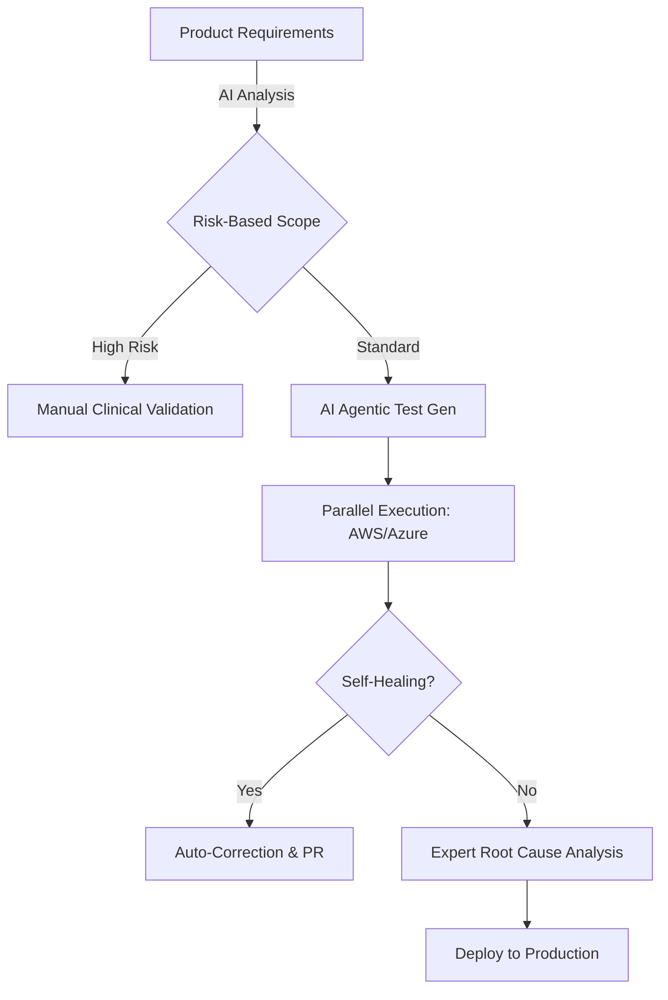

# Darshil Shah | QA Engineering Leader & AI Architect

### *Transforming Healthcare Quality through AI-Driven Engineering & Compliance*

---

## 🚀 Executive Summary

Senior QA Leader with a track record of transforming delivery for **Fortune 500 healthcare clients** (Accenture). I architect quality ecosystems where **AI-driven automation** meets **stringent regulatory compliance** (HIPAA, FDA, ISO).

* **Scale:** Led & mentored global teams of **15+ engineers** across multiple time zones.
* **Impact:** Realized a **40% reduction in patient care costs** via Shift-Left and Risk-Based Testing strategies.
* **Innovation:** 2025 focus on **AI Agent Architecture** and **MCP (Model Context Protocol)** integration to automate the STLC.

---

## 🧠 Strategic QE Framework

I move beyond "testing" to build **Quality Intelligence Systems**. My approach integrates AI agents at every gate to ensure safety-critical healthcare applications are both fast and compliant.

---

## 🛠️ Technical Ecosystem & Mastery

| Domain | Expert Tech Stack |
| --- | --- |
| **Leadership** | Strategic Roadmap, Resource Modeling, Agile/Scrum (Registered Scrum Basics™) |
| **AI & LLM** | Anthropic MCP, Google Gemini, Prompt Engineering, AI Agent Architecture |
| **Automation** | Rest Assured, Postman, Selenium, Java, Python, SQL |
| **Cloud & DevOps** | AWS (Certified), Azure, Microsoft Copilot, MLOps for Gen-AI |
| **Compliance** | HIPAA, FDA 21 CFR Part 11, ADA Accessibility, EHR/EMR Integration |

---

## 📂 Featured Impact Projects

### **1. AI-Powered Clinical Validation**

Pioneered the use of LLMs to validate complex medical data sets against HIPAA standards.

* **Result:** Improved patient wait times by **30%** by accelerating SIT and E2E cycles.
* **Stack:** Python, LLM Frameworks, SQL, AWS.

### **2. Gemini Omni Suite & DocuSearch**

Developed specialized AI agents for parsing and testing high-stakes medical documentation.

* **Result:** Reduced documentation audit time by **50%** while ensuring 100% compliance accuracy.
* **Stack:** Google Gemini, TypeScript, RAG Architecture.

---

## 🎓 2025 Learning Path & Credits

* **AI Agentic Systems:** *Becoming an AI Agent Architect (IBM)* | *Intro to MCP (Anthropic)*
* **Cloud & MLOps:** *AWS Cloud Practitioner Essentials* | *MLOps for Gen-AI (Google)*
* **Agile Leadership:** *Registered Scrum Basics™ (Scrum Inc.)*

---

## 🤝 Connect & Collaborate

* **Location:** Dallas / Irving, TX (Open to Remote)
* **Status:** 🇺🇸 **U.S. Citizen** · 🚀 **Immediate Joiner**
* **Philosophy:** Leadership through empathy, integrity, and technical excellence.

**Would you like me to generate a specific "Technical Case Study" based on your Accenture work to add as a separate repository link?**
