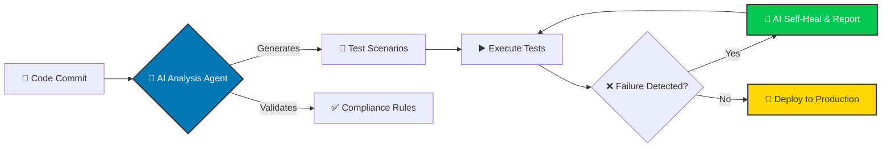

<div align="center">


## 🔗 Connect & Certify

<p>
    <a href="https://www.linkedin.com/in/darshil-qa-lead/">
        
    </a>
    <a href="mailto:darshils99@gmail.com">
        
    </a>
    <a href="https://github.com/darshil0">
        
    </a>
    <a href="https://x.com/soulsurfer300">
        
    </a>
</p>

<p>
    <a href="https://www.credly.com/users/darshil-shah.qa/badges"></a>
    <a href="https://www.coursera.org/learner/darshil-shah-1990"></a>
    <a href="https://www.skills.google/public_profiles/b4c10d9b-a4e0-4fe6-ba1b-7ac3d2b15158"></a>
    <a href="https://docs.google.com/spreadsheets/d/1hf4n6WS9du7Iljhnz-i56xMhFYlOjcVn/edit"></a>
    <a href="https://learn.microsoft.com/en-us/users/darshilshah-7981/"></a>
    <a href="https://docs.google.com/document/d/1w2PM0M6tK6_GAuhEg0YcaoOF8FQtEwxDj_2kOjWPBCs/edit"></a>
    <a href="https://www.salesforce.com/trailblazer/darshilshah30"></a>
</p>

</div>

---

## 💡 Profile Summary

I am a **QA Leader with 9+ years** of success in driving digital transformation and quality engineering, primarily within the **healthcare technology** sector. I specialize in leading global, multi-site teams to establish robust quality strategies that **accelerate release velocity** and ensure **strict regulatory compliance** (HIPAA, FDA 21 CFR Part 11).

My focus is on the future of QA: leveraging advanced certifications in **AI/ML, Prompt Engineering, and Cloud Technologies** to architect next-generation, self-healing, and intelligent test automation frameworks.

> **Current Status:** 🇺🇸 US Citizen | ✅ No Sponsorship Required | 🚀 Immediate Joiner

### 🎯 Actively Seeking

```yaml
Target Roles: QA Leader • Senior QA Lead • QA Manager • Test Manager • Project Manager (QA)
Industries: Healthcare Technology • Financial Services • IT Consulting • Tech Firms
Preferred Orgs: CVS Health • Cigna • UHG • Accenture • Infosys • TCS • NVIDIA • Bank of America • Verizon • Fidelity
Location: Dallas/Irving, TX (Hybrid/On-site) or Remote
````

-----

## 🏆 Key Quality Impact & Achievements

I measure success by the tangible impact on patient care and business efficiency.

\<div align="center"\>

| Metric | Impact | Description |
|--------|--------|-------------|
| 💰 **Patient Care Costs** | **-40%** | Reduced through shift-left testing and early-stage defect prevention. |
| ⏱️ **Patient Wait Times** | **-30%** | Decreased via enhanced end-to-end QA methodologies in critical systems. |
| 📈 **Test Coverage** | **+25%** | Increased across complex, regulated healthcare applications. |
| ⭐ **Quality Score** | **100%** | Achieved defect-free delivery on major client initiatives (Client Recognized). |
| 👥 **Leadership & Scale** | **15+ Engineers** | Successfully built, led, and mentored global quality engineering teams. |

\</div\>

-----

## 🧠 Core Technical Expertise

My expertise spans full-stack quality assurance, cloud integration, and cutting-edge AI implementation.

\<table\>
\<tr\>
\<td width="50%" valign="top"\>

### 🧪 QA & Automation Engineering

```
Core Domains
├── API & E2E Testing
├── Regression & Performance Testing
├── Mobile Automation (Appium)
└── Web Automation (Selenium/Playwright)

Automation Tools
├── Java (TestNG) & Python (Pytest)
├── Rest Assured & Postman/SoapUI
├── Cucumber (BDD)
└── Perfecto / BrowserStack
```

\</td\>
\<td width="50%" valign="top"\>

### ☁️ Cloud, AI & Compliance

```
Cloud & DevOps
├── AWS (Certified) / Azure / GCP
├── CI/CD Pipelines (Jenkins/Git)
└── Containerization (Docker)

Healthcare Compliance
├── HIPAA & PHI Security
├── FDA 21 CFR Part 11
└── HL7 / FHIR Standards

AI/ML for QA
├── Prompt Engineering
├── LLM Evaluation Frameworks
└── MLOps Principles
```

\</td\>
\</tr\>
\</table\>

### 💻 Languages & Key AI Tools

**Languages:** `Java` `Python` `JavaScript` `SQL`

**AI Tools:** Perplexity Comet • Google Gemini Jules • Anthropic Claude Sonnet 4.5 • Google Antigravity • Google Veo 3 • OpenAI Sora 2

-----

## 🚀 Current Focus: AI-Powered Healthcare QA

I am committed to transforming the Software Testing Life Cycle (STLC) by integrating **AI agents** to automate complex compliance checks and enable **self-healing regression test suites**.



**Key Research & Implementation Areas:**

  * Automated test case generation using Large Language Models (LLMs).
  * Developing truly self-healing and resilient test automation frameworks.
  * Integrating AI for predictive defect analysis and risk-based testing.

-----

## 📂 Featured Projects & Frameworks

A selection of repositories demonstrating my approach to quality engineering and AI integration.

\<div align="center"\>

| Project | Description | Tech Stack | Link |
|---------|-------------|------------|------|
| 🎯 **AI Evaluation QA** | Production-grade framework for evaluating AI model responses with structured prompts, rubric-based scoring, and automated reporting. | `Python` `LLM Eval` | [View →](https://github.com/darshil0/AI-Evaluation-QA) |
| ✈️ **Flight Tracker App** | Full-stack flight tracking application built for real-time data integration and a modern responsive interface. | `TypeScript` `React` `PostgreSQL` | [View →](https://github.com/darshil0/flighttrackerapp) |
| 🤖 **AI Prompts Library** | Interactive library for storing, organizing, and accessing advanced AI prompts for coding, design, and reasoning tasks. | `HTML` `CSS` `JavaScript` | [View →](https://github.com/darshil0/ai-prompts-2025) |
| 📱 **Mobile Testing Framework** | Robust mobile automation framework using Appium and TestNG with a scalable Page Object Model design. | `Java` `Appium` `TestNG` | [View →](https://github.com/darshil0/mobile-testing-framework) |
| 🌐 **Web Testing Framework** | Lightweight, data-driven web automation framework optimized for fast execution and CI/CD integration. | `Java` `Selenium` `TestNG` | [View →](https://github.com/darshil0/Web-Testing-Framework) |

\</div\>

-----

## 🛠️ Technology Stack at a Glance

A visual representation of the tools and technologies I use to build and assure quality.

\<div align="center"\>

### Languages & Frameworks

### Testing & Automation

### Cloud & DevOps

### AI & ML

\</div\>

-----

\<div align="center"\>

### 📊 GitHub Activity

\
\
\

-----

### 📬 Let's Collaborate\!

I am always open to discussing new opportunities in **Healthcare QA Leadership** and collaborating on **AI-Powered Quality Engineering** projects.

[](https://www.linkedin.com/in/darshil-qa-lead/)
[](mailto:darshils99@gmail.com)
[](https://github.com/darshil0/darshil-portfolio)

\

\<p\>\<i\>"Quality is not an act, it is a habit." — Aristotle\</i\>\</p\>

\</div\>
