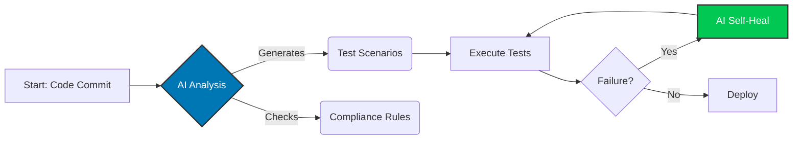

<!--
Hello! Thanks for checking out the source code of my README.
You can find the raw markdown file at:
https://raw.githubusercontent.com/darshil0/darshil0/main/README.md

Feel free to use this as a template for your own profile!
-->

<!-- HEADER -->

<!-- SOCIAL LINKS -->
### 🤝 Connect With Me

  
  
  

<!-- CERTIFICATION LINKS -->

  
  
  
  
  
  
  

 

<!-- GITHUB STATS -->

---

<!-- ABOUT ME -->
## 👋 About Me

**QA Leader with 9+ years** driving digital transformation in healthcare technology. I lead global teams to accelerate release cycles, optimize test coverage, and ensure regulatory compliance in highly regulated environments. Certified in **AI/ML, Prompt Engineering, and Project Management**, I combine technical excellence with strategic vision to deliver user-centric products.

> **🟢 Status:** US Citizen • No Sponsorship Required • Immediate Joiner

<!-- OPEN TO WORK -->
### 💼 Open to Work

- **Target Roles**: QA Lead • Senior QA Lead • QA Manager • Test Manager • Project Manager (QA)
- **Industries**: Healthcare Technology • Financial Services • IT Consulting • Tech Firms
- **Preferred Orgs**: CVS Health • Cigna • UHG • Accenture • Infosys • TCS • NVIDIA • Bank of America • Verizon • Fidelity
- **Location**: **Dallas/Irving, TX** (Hybrid/On-site) or **Remote**

---

<!-- TECHNICAL EXPERTISE -->
## 🧰 Technical Expertise

### 🔍 QA & Automation
- **Methodologies**: API, E2E, Regression, SIT, Smoke, Exploratory
- **Automation**: Selenium WebDriver, Appium, Playwright
- **Frameworks**: TestNG, Cucumber, Rest Assured
- **Tools**: Postman, SoapUI, Perfecto, JIRA, TestRail

### ☁️ Cloud & AI
- **Cloud**: AWS Certified, Azure, GCP, CI/CD (Jenkins/Git)
- **Healthcare**: HIPAA, FDA 21 CFR, HL7/FHIR, EHR/EMR
- **AI Tech**: ChatGPT, Claude, Gemini, LLM Eval, MLOps
- **Languages**: Java, Python, JavaScript, SQL

---

<!-- KEY ACHIEVEMENTS -->
## 🏆 Key Achievements

- 🩺 **-40% Costs**: **Patient Care Costs** reduced through shift-left strategies
- ⏱️ **-30% Time**: **Patient Wait Times** reduced via enhanced QA strategies
- 📈 **+25% Coverage**: **Test Coverage** increased across high-profile healthcare apps
- ⭐ **100% Quality**: **Defect-free delivery** achieved (Client Recognized)
- 👥 **15+ Engineers**: **Global Team Size** led and scaled successfully

---

<!-- FEATURED PROJECTS -->
## 📂 Featured Projects

### 🧠 [AI-driven-Test-Data-Generation](https://github.com/darshil0/AI-driven-Test-Data-Generation)
A tool that uses generative AI to create realistic and diverse test data for healthcare applications, improving test coverage and accuracy.
 
`Python` `Generative AI` `FastAPI` `PySpark`

### 📱 [mobile-testing-framework](https://github.com/darshil0/mobile-testing-framework)
A production-ready mobile automation framework using Appium and TestNG with Page Object Model design, built for scalability and maintainability.
 
`Appium` `TestNG` `Java` `POM` `CI/CD`

### ♿ [Automated-Accessibility-Testing-for-HIPAA](https://github.com/darshil0/Automated-Accessibility-Testing-for-HIPAA)
A framework for automating accessibility testing to ensure compliance with WCAG and HIPAA standards in healthcare applications.
 
`Playwright` `Axe-Core` `JavaScript` `CI/CD`

### 🌐 [Web-Testing-Framework](https://github.com/darshil0/Web-Testing-Framework)
A lightweight web automation framework with Java, Selenium, and TestNG, featuring data-driven testing and CI/CD integration.
 
`Selenium` `Java` `TestNG` `CI/CD`

---

<!-- CERTIFICATIONS -->
## 📜 Certifications & Continuous Learning

### 🤖 Generative AI & Machine Learning (2025)
- **ChatGPT Prompt Engineering For Developers** | Coursera
- **Develop Generative AI Apps in Azure** | Microsoft
- **From Learner to Builder: AI Agent Architect** | IBM
- **Gen AI: Beyond the Chatbot** | Google
- **AI Fluency Framework** | Anthropic

### ☁️ Cloud, Agile & Compliance (2025)
- **MLOps for Generative AI** | Google
- **AWS Cloud Practitioner Essentials** | AWS
- **Registered Scrum Basics™** | Scrum Inc.
- **GitHub Responsible AI** | Microsoft

---

<!-- CURRENT FOCUS -->
## 💡 Current Focus: AI-Powered Healthcare QA

I am actively researching and implementing AI agents into the STLC to automate compliance and self-heal regression suites.

<!-- FOOTER -->

<i>"Quality is not an act, it is a habit."</i>

