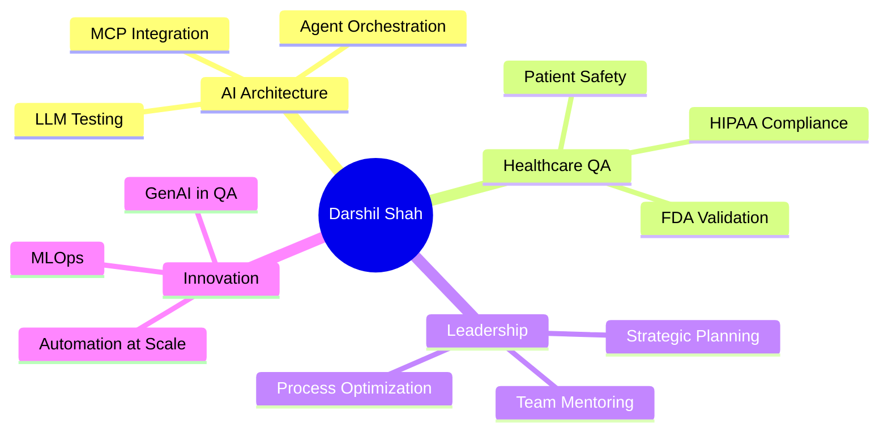

<div align="center">

# 👋 Hi, I'm Darshil Shah

### QA Engineering Leader | AI Architect | Functional Testing Expert | Healthcare Technology Specialist

[](https://www.linkedin.com/in/darshil-qa-lead/)
[](https://x.com/soulsurfer300)
[](mailto:darshils99@gmail.com)


</div>

---

## 🚀 About Me

I'm a **Senior QA Leader** with 9+ years of experience transforming healthcare delivery for Fortune 500 clients at **Accenture, Infosys, Prime Therapeutics, and Kaiser Permanente**. I architect quality ecosystems where AI-driven automation meets stringent regulatory compliance (HIPAA, FDA, ISO 13485).

```javascript
const darshil = {
    location: "Dallas/Irving, TX 🇺🇸",
    role: "QA Engineering Leader & AI Architect",
    expertise: ["Healthcare QA", "Functional Testing", "AI Testing", "Compliance Engineering"],
    currentFocus: "AI Agent Architecture & MCP Integration",
    openTo: ["QA Leadership", "AI Consulting", "Healthcare Innovation"],
    impact: {
        costReduction: "40% reduction in patient care costs",
        efficiency: "30% improvement in patient wait times",
        teamLeadership: "15+ engineers across global teams"
    }
};
```

---

## 💼 Professional Impact

<div align="center">

| 🎯 Achievement | 📊 Impact |
|---------------|----------|
| **Patient Care Cost Reduction** | 40% through Shift-Left & Risk-Based Testing |
| **Wait Time Improvement** | 30% via streamlined functional testing workflows |
| **Team Leadership** | 15+ global engineers across multiple time zones |
| **Compliance Rate** | 100% across HIPAA, FDA, ISO audits |
| **Manual Validation Reduction** | 60% through AI-powered functional testing |

</div>

---

## 🛠️ Technical Arsenal

### Core Competencies

```text
Leadership & Strategy     ████████████████████ 100%
AI & LLM Engineering     ███████████████████░  95%
Functional Testing       ████████████████████ 100%
Healthcare Compliance    ████████████████████ 100%
Cloud & DevOps           ██████████████████░░  90%
```

<details>
<summary>💻 <b>Full Tech Stack</b></summary>

#### 🤖 AI & Machine Learning


#### ⚙️ Functional Testing & QA


#### ☁️ Cloud & DevOps


#### 🔧 Development & Tools


#### 📋 Project Management


</details>

---

## 🎓 Recent Certifications (2025)

<div align="center">

| 📜 Certification | 🏢 Provider | 📅 Date |
|-----------------|------------|---------|
| **Introduction to MCP** | Anthropic | Oct 2025 |
| **AI Fluency Framework & Foundations** | Anthropic | Aug 2025 |
| **Registered Scrum Basics™** | Scrum Inc. | Aug 2025 |
| **Becoming an AI Agent Architect** | IBM | Jul 2025 |
| **ChatGPT Prompt Engineering** | Coursera | Jul 2025 |
| **MLOps for Generative AI** | Google | Jun 2025 |
| **Microsoft Copilot Foundations** | Microsoft | Jun 2025 |
| **AWS Cloud Practitioner Essentials** | AWS | May 2025 |

</div>

---

## 🏆 Featured Projects

### 🤖 AI-Powered Solutions

#### 1. [Customer Support Agent](https://github.com/darshil0/customer-support-agent)
Production-ready intelligent customer support built with Google Agent Development Kit (ADK) for Java, showcasing enterprise-grade multi-agent orchestration.

**Tech Stack:** `TypeScript` `Google ADK` `Multi-Agent Systems`

---

#### 2. [Gemini Omni Suite](https://github.com/darshil0/Gemini-Omni-Suite)
Multi-modal AI workspace featuring Intelligent Email Agent, Generative Image Editor, and Real-time Voice Assistant with modern glassmorphic UI.

**Tech Stack:** `React` `TypeScript` `Google Gemini 2.5` `Multi-Modal AI`

**Key Features:**
- 🎤 Real-time voice interaction with Gemini 2.5
- ✉️ Intelligent email composition and analysis
- 🎨 AI-powered image editing capabilities

---

#### 3. [Gemini PDF Retrieval Agent](https://github.com/darshil0/gemini-pdf-retrieval-agent)
Intelligent document search engine powered by Google Gemini 2.5. Upload multiple PDFs, perform context-aware searches, and jump to exact citations.

**Tech Stack:** `TypeScript` `Google Gemini 2.5` `RAG Architecture` `PDF.js`

**Impact:** 50% reduction in document audit time with 100% compliance accuracy

---

### 🧪 QA & Testing Innovation

#### 4. [AI-Evaluation-QA](https://github.com/darshil0/AI-Evaluation-QA)
Production-grade framework for evaluating AI model responses through structured prompts, rubric-based scoring, and automated reporting.

**Tech Stack:** `Python` `LLM Testing` `Automated Evaluation`

**Use Cases:** Quality assurance for AI systems, prompt engineering validation, model performance benchmarking

---

### 📚 Knowledge & Resources

#### 5. [AI Prompts 2025](https://github.com/darshil0/ai-prompts-2025)
Curated collection of enterprise-grade AI prompts for various use cases including QA, healthcare, and automation.

**Tech Stack:** `HTML` `Prompt Engineering` `Best Practices`

---

## 📊 GitHub Statistics

<div align="center">


</div>

---

## 🎯 Current Focus Areas



---

## 💡 Leadership Philosophy

> "Quality engineering is a strategic business enabler, not a cost center. Teams perform best when mentored with empathy and equipped with cutting-edge tools."

**Core Values:**
- 🤝 **Empathy** - Understanding team needs and user impact
- 🔒 **Integrity** - Zero-compromise approach to patient safety
- 💬 **Transparency** - Open communication across all stakeholders
- 🚀 **Innovation** - Continuous learning and tool adoption

---

## 📫 Let's Connect

I'm actively seeking **QA Leadership** and **AI Consulting** opportunities in healthcare technology where I can drive quality transformation at scale.

<div align="center">

**🇺🇸 U.S. Citizen | 🚀 Immediate Joiner | 📍 Dallas/Irving, TX**

[](https://www.linkedin.com/in/darshil-qa-lead/)
[](mailto:darshils99@gmail.com)
[](https://x.com/soulsurfer300)

</div>

---

## 🌟 Fun Facts

- 🏥 Specialized in preventing patient safety risks through AI-driven quality systems
- 🤖 Built AI agents that reduced manual functional testing effort by 60%
- 🎓 Continuous learner with 8+ AI/ML certifications in 2025 alone
- 🌍 Led global teams across 3 continents
- 💼 Delivered $2M+ in cost savings for Fortune 500 healthcare clients

---

<div align="center">

### "I lead QA teams that do far more than find bugs—we prevent patient safety risks, drive measurable business impact, and enable safer, smarter healthcare innovation."


**⭐ Star my repositories if you find them useful!**

</div>
