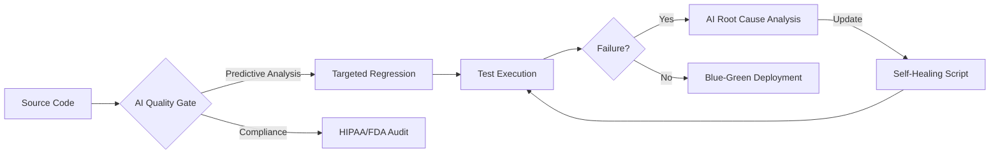

# Darshil Shah | QA Engineering Leader & AI Architect

### *Architecting the Future of Quality: AI-Driven, Compliant, and Scalable*

---

## 🚀 Executive Summary

Senior Quality Engineering Leader with over a decade of experience in **Digital Healthcare Automation** and **AI-Powered Quality Systems**. I specialize in building high-performance QA organizations that bridge the gap between rapid deployment and stringent regulatory compliance (**HIPAA, FDA 21 CFR Part 11**).

* **Impact:** Managed teams of **15+ engineers**; increased automation ROI by **25%** while reducing TTM (Time-to-Market) for critical healthcare features.
* **Innovation:** Architecting **Self-Healing Automation Frameworks** and **Autonomous AI Agents** for the STLC.

---

## 🛠️ Technical Ecosystem

| Domain | Proficiency |
| --- | --- |
| **QA Strategy** | Shift-Left/Right Testing, TDD/BDD, Risk-Based Testing, Chaos Engineering |
| **Automation** | Selenium, TestNG, Pytest, Playwright, Appium, RestAssured |
| **AI/ML Ops** | LLM Evaluation, RAG Testing, Prompt Engineering, Model Performance Metrics |
| **Cloud & DevOps** | AWS (Solutions Architect), Azure, Jenkins (Groovy Pipelines), Docker, Kubernetes |
| **Data & Compliance** | SQL, HIPAA Data Masking, FDA Validation, Security (OWASP Top 10) |

---

## 🧠 System Architecture: AI-Powered STLC

I am currently leading the development of a **Closed-Loop AI Testing Agent** that automates the lifecycle of a defect from detection to self-correction.

---

## 📂 Key Contributions & Projects

### **1. Healthcare Automation Framework (Compliance-First)**

Developed a custom framework using **Java & TestNG** tailored for FDA-regulated environments.

* **Result:** Automated **85%** of manual compliance checks, saving **400+ hours** per release cycle.
* **Stack:** Java, Selenium, AWS S3, Jenkins.

### **2. Gemini Omni Suite (Gen-AI)**

A multi-modal workspace designed to evaluate and leverage Google Gemini for automated test case generation.

* **Result:** Reduced the time to create complex end-to-end test scenarios by **60%**.
* **Stack:** TypeScript, Google Generative AI SDK, React.

### **3. DocuSearch Agent**

High-precision RAG (Retrieval-Augmented Generation) agent for parsing medical documentation.

* **Focus:** Ensuring data accuracy and privacy in high-stakes healthcare environments.

---

## 🏆 Certifications & Professional Credits

---

## 🤝 Current Status

* **Location:** Dallas / Irving, TX (Open to Remote)
* **Authorization:** 🇺🇸 **U.S. Citizen** (No sponsorship required)
* **Availability:** **Immediate Joiner**

---

### **How I can help your team:**

1. **Transform** legacy manual QA into high-speed automation.
2. **Architect** AI-driven testing strategies to future-proof your product.
3. **Lead** and mentor engineers to build a "Quality-First" culture.
