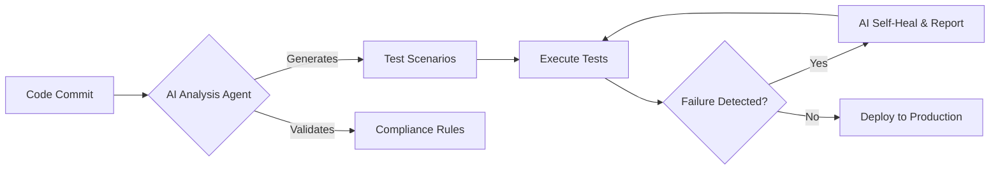

## Hi, I'm Darshil 👋  

**QA Engineering Leader | AI Automation Architect | Healthcare Tech Specialist**

Driven by precision, compliance, and efficiency — I design **AI-powered Quality Engineering systems** that enhance digital healthcare performance and compliance (HIPAA, FDA 21 CFR Part 11).  

***

### 📘 Table of Contents
- [About Me](#about-me)  
- [What I Build & Deliver](#what-i-build--deliver)  
- [Core Technical Stacks](#core-technical-stacks)  
- [Current Focus](#current-focus)  
- [Featured Projects](#featured-projects)  
- [Certifications](#certifications)  
- [Connect](#connect)

***

## 🏗️ What I Build & Deliver
I lead cross-functional QA teams and architect next-generation automation frameworks to ensure seamless digital healthcare experiences.

- **Healthcare Compliance QA:** End-to-end automation aligned with **HIPAA** and **FDA 21 CFR Part 11**.  
- **AI-Powered Automation:** Intelligent frameworks leveraging **LLMs** for predictive defect detection and test case generation.  
- **Self-Healing Frameworks:** Adaptive test automation using **Java (TestNG)** and **Python (Pytest)**.  
- **Enterprise Cloud QA:** Scalable QA solutions across **AWS**, **Azure**, and **GCP**, with **Jenkins CI/CD** integration.  
- **Team Leadership:** Building and mentoring distributed QA teams (15+ engineers).  
- **Impact:** Reduced patient wait times by **30%**, increased automated test coverage by **25%+**.

***

## 🧠 Core Technical Stacks

| Area | Tools & Platforms |
|------|--------------------|
| **Quality Engineering** | Postman, TestNG, Pytest, Cucumber (BDD), REST API Testing, E2E Testing |
| **CI/CD & Cloud** | Jenkins, **AWS (Certified)**, Azure, GCP |
| **AI & LLMs** | Prompt Engineering, Model Evaluation, MLOps, Google Gemini, Anthropic Claude |
| **Languages** | `Java` `Python` `TypeScript` `SQL` |
| **Methodologies** | Agile, Scrum, Regression, SIT, BVT, Functional & Non-Functional Testing |

***

## 🚀 Current Focus
Exploring the integration of **autonomous AI agents** into the Software Testing Life Cycle (STLC) — enabling test generation, compliance checks, and self-healing execution.

***

## 📂 Featured Projects

- **[Gemini Omni Suite](https://github.com/darshil0/Gemini-Omni-Suite)**  
  Multi-modal AI workspace integrating generative tools and real-time collaboration.  
  `React` `TypeScript` `Vite` `Tailwind CSS` `Google Generative AI SDK`

- **[DocuSearch Agent](https://github.com/darshil0/gemini-pdf-retrieval-agent)**  
  PDF retrieval agent powered by **Google Gemini 2.5 Flash**.  
  `React` `TypeScript` `Vite` `Tailwind CSS` `pdfjs-dist`

- **[Flight Tracker App](https://github.com/darshil0/flighttrackerapp)**  
  Full-stack app for real-time flight data visualization.  
  `TypeScript` `React` `PostgreSQL`

- **[AI Evaluation QA](https://github.com/darshil0/AI-Evaluation-QA)**  
  Framework for automated AI model evaluation and reporting.  
  `Python` `LLM Eval`

- **[Web Testing Framework](https://github.com/darshil0/Web-Testing-Framework)**  
  Lightweight, CI/CD-aligned automation system using **Selenium + TestNG**.  
  `Java` `Selenium` `TestNG`

***

## 🤝 About Me

**🎯 Seeking:** QA Lead / QA Manager / Test Manager roles in **Healthcare Tech, Finance, or IT Consulting** (Dallas/Irving, TX or Remote)  

**📜 Certifications:** Generative AI | AWS Cloud | Agile/Scrum  

**🧑‍💼 Status:** 🇺🇸 U.S. Citizen · ✅ No Sponsorship Required · 🚀 Immediate Joiner  

***

## 🎓 Certifications

***

## 🔗 Connect

***
