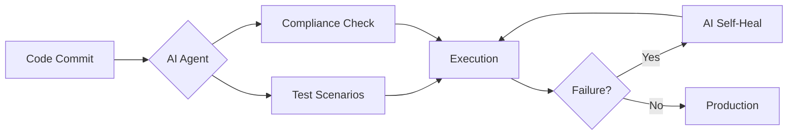

# Hi, I'm Darshil 👋

### **QA Engineering Leader | AI Automation Architect | Healthcare Tech Specialist**

Driven by precision, compliance, and efficiency, I design **AI-powered Quality Engineering systems** that enhance digital healthcare performance and ensure rigorous regulatory compliance (**HIPAA, FDA 21 CFR Part 11**).

---

## 📘 Table of Contents

* [What I Build & Deliver](https://www.google.com/search?q=%23-what-i-build--deliver)
* [Core Technical Stacks](https://www.google.com/search?q=%23-core-technical-stacks)
* [Current Focus](https://www.google.com/search?q=%23-current-focus-ai-powered-healthcare-qa)
* [Featured Projects](https://www.google.com/search?q=%23-featured-projects--frameworks)
* [About Me](https://www.google.com/search?q=%23-about-me)
* [Certifications](https://www.google.com/search?q=%23-certifications--learning-platforms)
* [Connect](https://www.google.com/search?q=%23-connect-with-me)

---

## 🏗️ What I Build & Deliver

I lead cross-functional QA teams and architect next-generation automation frameworks to ensure seamless digital healthcare experiences.

* **Healthcare Compliance QA:** End-to-end automation aligned with **HIPAA** and **FDA 21 CFR Part 11**.
* **AI-Powered Automation:** Intelligent frameworks leveraging LLMs for predictive defect detection and automated test generation.
* **Self-Healing Frameworks:** Adaptive test automation using **Java (TestNG)** and **Python (Pytest)** to reduce maintenance.
* **Enterprise Cloud QA:** Scalable solutions across **AWS, Azure, and GCP** with robust **Jenkins CI/CD** integration.
* **Team Leadership:** Experienced in building and mentoring distributed QA teams of **15+ engineers**.
* **Proven Impact:** Reduced patient wait times by **30%** and increased automated test coverage by **25%+**.

---

## 🧠 Core Technical Stacks

| Area | Tools & Platforms |
| --- | --- |
| **Quality Engineering** | Postman, TestNG, Pytest, Cucumber (BDD), REST API, E2E Testing |
| **CI/CD & Cloud** | Jenkins, AWS (Certified), Azure, GCP |
| **AI & LLMs** | Prompt Engineering, Model Evaluation, MLOps, Google Gemini, Anthropic Claude |
| **Languages** | Java, Python, TypeScript, SQL |
| **Methodologies** | Agile, Scrum, Regression, SIT, BVT, Functional & Non-Functional |

---

## 🚀 Current Focus: AI-Powered Healthcare QA

I am integrating **autonomous AI agents** into the Software Testing Life Cycle (STLC) to enable automated test generation and compliance validation.

---

## 📂 Featured Projects & Frameworks

* **Gemini Omni Suite** – Multi-modal AI workspace integrating generative tools and real-time collaboration.
* **DocuSearch Agent** – PDF retrieval agent powered by Google Gemini 2.5 Flash for rapid documentation parsing.
* **AI Evaluation QA** – Custom framework for automated AI model evaluation and performance benchmarking.
* **Web Testing Framework** – Lightweight automation system using Selenium + TestNG for enterprise scalability.

---

## 🤝 About Me

* **Seeking:** QA Lead / QA Manager / Test Manager roles (Dallas/Irving, TX or Remote).
* **Expertise:** Healthcare Tech, Finance, and IT Consulting.
* **Status:** 🇺🇸 **U.S. Citizen** · 🚀 **Immediate Joiner** · ✅ **No Sponsorship Required**.

---

## 🎓 Certifications & Learning Platforms

## 🔗 Connect With Me

