## Hi, I'm Darshil 👋

I **lead Quality Engineering teams** and architect **AI-driven automation frameworks** tailored specifically for the highly regulated **Healthcare Technology** sector.

My mission is to **reduce patient care costs (-40%)** and **accelerate release velocity** by building robust, compliance-first QA strategies (HIPAA, FDA 21 CFR Part 11).

Most of my work is focused on **shifting QA left** by embedding intelligent agents that automatically generate tests, enforce regulatory rules, and enable self-healing regression suites.

---

## 🏗️ What I Build & Deliver

I deliver next-generation QA systems and lead high-impact teams to ensure flawless digital patient experiences.

* **🏥 Healthcare Compliance QA:** Automated testing and validation processes adhering strictly to **HIPAA** and **FDA 21 CFR Part 11**.
* **🤖 AI-Powered Automation:** Designing and implementing intelligent frameworks that use LLMs for **test case generation** and **predictive defect analysis**.
* **🛠️ Self-Healing Frameworks:** Deploying resilient, data-driven automation using **Java (TestNG)** and **Python (Pytest)** that automatically adapts to UI changes.
* **☁️ Enterprise Cloud QA:** Quality strategy for applications hosted on **AWS, Azure, and GCP**, integrated directly into CI/CD pipelines (Jenkins, Git).
* **👥 Global QA Leadership:** Building, mentoring, and scaling distributed QA teams (15+ engineers) to achieve **100% defect-free delivery**.
* **🎯 Impact-Driven Results:** Tangible outcomes, including **30% reduction in patient wait times** and **25%+ increase in test coverage**.

---

## 🧠 Core Technical Stacks

| Area | Key Expertise & Tools |
|---|---|
| **Quality Engineering** | API & E2E Testing, Postman, Cucumber (BDD), Scrum & Regression Testing, SIT, Prod and Non-Prod Testing, BVT Testing, Black Box, White Box Testing |
| **Cloud & DevOps** | **AWS (Certified)**, Azure, GCP, Jenkins |
| **AI & LLMs** | Prompt Engineering, LLM Evaluation Frameworks, MLOps, Google Gemini, Anthropic Claude, Perplexity |
| **Languages** | `Java` `Python` `JavaScript` `SQL` |

---

## 🚀 Current Focus: AI-Powered Healthcare QA

My research and implementation are centered on transforming the Software Testing Life Cycle (STLC) using AI agents.

```mermaid
graph LR
    A[🚀 Code Commit] --> B{🤖 AI Analysis Agent}
    B -->|Generates| C[📝 Test Scenarios]
    B -->|Validates| D[✅ Compliance Rules]
    C --> E[▶️ Execute Tests]
    E --> F{❌ Failure Detected?}
    F -->|Yes| G[🔧 AI Self-Heal & Report]
    G --> E
    F -->|No| H[🎉 Deploy to Production]
        
    style B fill:#0077B5,stroke:#333,stroke-width:2px,color:#fff
    style G fill:#00C853,stroke:#333,stroke-width:2px,color:#fff
    style H fill:#FFD700,stroke:#333,stroke-width:2px,color:#333
```

---

## 📂 Featured Projects & Frameworks

### 🎯 Gemini Omni Suite
A multi-modal AI workspace built with React and Google Gemini 2.5. Features an Intelligent Email Agent, Generative Image Editor, and Real-time Live Voice Assistant wrapped in a modern glassmorphic UI.

**Core Technologies:**
* React 18.3 - UI framework with hooks and concurrent features
* TypeScript 5.2 - Type-safe development
* Vite 5.3 - Lightning-fast build tool
* Tailwind CSS 3.4 - Utility-first styling

**AI & APIs:**
* Google Generative AI SDK 0.21.0 - Gemini integration
* WebSocket API - Real-time voice communication
* Web Audio API - Audio processing and visualization

**Development Tools:**
* Vitest - Unit and integration testing
* ESLint - Code quality enforcement
* PostCSS - CSS processing
* Autoprefixer - Browser compatibility

**🎨 Design Philosophy:**

*Glassmorphism UI* - The interface features a modern glassmorphic design with frosted glass effect, backdrop blur, subtle transparency layers, soft shadows and borders, and smooth color gradients.

*Dark & Light Modes* - Dark Mode features deep gradients with vibrant accents (default), while Light Mode offers a clean, airy palette with soft shadows. Theme preference persists via localStorage.

*Responsive Design* - Mobile-first approach with breakpoints at sm (640px), md (768px), lg (1024px), xl (1280px), touch-optimized interactions, and adaptive layouts for all screen sizes.

[View on GitHub →](https://github.com/darshil0/Gemini-Omni-Suite)

---

### 📄 DocuSearch Agent
Enterprise-grade PDF document retrieval agent powered by Google Gemini 2.5 Flash. An intelligent document search system that uses Google's Gemini 2.5 Flash AI model to enable natural language querying across multiple PDF documents.

**Technology Stack:**

*Frontend:*
* React 19.2 - Modern UI library with concurrent features
* TypeScript 5.2 - Type-safe development with strict mode
* Vite 5.2 - Fast build tool with HMR
* Tailwind CSS 3.4 - Utility-first CSS framework
* Lucide React - Beautiful icon library

*AI & Processing:*
* Google Gemini 2.5 Flash - Advanced AI language model
* pdfjs-dist 5.4 - PDF parsing and rendering
* react-pdf 10.2 - React PDF viewer components

*Testing & Quality:*
* Vitest 4.0 - Fast unit testing framework
* React Testing Library 16.3 - Component testing utilities
* ESLint 8.57 - Code linting and style enforcement
* Prettier 3.7 - Code formatting
* TypeScript ESLint - TypeScript-specific linting rules

[View on GitHub →](https://github.com/darshil0/gemini-pdf-retrieval-agent)

---

### 🎯 AI Evaluation QA
Production-grade framework for evaluating AI model responses with structured prompts, rubric-based scoring, and automated reporting.

**Tech Stack:** `Python` `LLM Eval`

[View on GitHub →](https://github.com/darshil0/AI-Evaluation-QA)

---

### ✈️ Flight Tracker App
Full-stack flight tracking application built for real-time data integration and a modern responsive interface.

**Tech Stack:** `TypeScript` `React` `PostgreSQL`

[View on GitHub →](https://github.com/darshil0/flighttrackerapp)

---

### 🌐 Web Testing Framework
Lightweight, data-driven web automation framework optimized for fast execution and CI/CD integration.

**Tech Stack:** `Java` `Selenium` `TestNG`

[View on GitHub →](https://github.com/darshil0/Web-Testing-Framework)

---

## 🤝 About Me

* **🎯 Actively Seeking:** QA Leader, Senior QA Lead, QA Manager, or Test Manager roles in **Healthcare Tech, Finance, or IT Consulting** (Dallas/Irving, TX or Remote).
* **📜 Certifications:** Extensive professional certifications in **Generative AI, Cloud (AWS), and Agile/Scrum**.
* **Status:** 🇺🇸 US Citizen | ✅ No Sponsorship Required | 🚀 Immediate Joiner
* **Connect:** I'd love to chat and share input on next-gen QA strategies, LLM evaluation, and scaling engineering teams.

---

## 🔗 Connect With Me

---

## 🎓 Certifications & Learning Platforms

