<!--
Hello! Thanks for checking out the source code of my README.
You can find the raw markdown file at:
https://raw.githubusercontent.com/darshil0/darshil0/main/README.md

Feel free to use this as a template for your own profile!
-->

<div align="center">

<!-- HEADER -->


<!-- SOCIAL LINKS -->
### 🤝 Connect With Me

<p>
  <a href="https://www.linkedin.com/in/darshil-qa-lead/">
    
  </a>
  <a href="mailto:darshils99@gmail.com">
    
  </a>
  <a href="https://x.com/soulsurfer300">
    
  </a>
  <a href="https://github.com/darshil0">
    
  </a>
</p>

<!-- CERTIFICATION LINKS -->
<p>
  <a href="https://www.coursera.org/learner/darshil-shah-1990"></a>
  <a href="https://www.credly.com/users/darshil-shah.qa/badges"></a>
  <a href="https://www.skills.google/public_profiles/b4c10d9b-a4e0-4fe6-ba1b-7ac3d2b15158"></a>
  <a href="https://docs.google.com/spreadsheets/d/1hf4n6WS9du7Iljhnz-i56xMhFYlOjcVn/edit"></a>
  <a href="https://learn.microsoft.com/en-us/users/darshilshah-7981/"></a>
  <a href="https://docs.google.com/document/d/1w2PM0M6tK6_GAuhEg0YcaoOF8FQtEwxDj_2kOjWPBCs/edit"></a>
  <a href="https://www.salesforce.com/trailblazer/darshilshah30"></a>
</p>

<br/>

<!-- GITHUB STATS -->


<br/>

<!-- GITHUB STREAK -->


</div>

---

<!-- ABOUT ME -->
## 👋 About Me

**QA Leader with 9+ years** driving digital transformation in healthcare technology. I lead global teams to accelerate release cycles, optimize test coverage, and ensure regulatory compliance in highly regulated environments. Certified in **AI/ML, Prompt Engineering, and Project Management**, I combine technical excellence with strategic vision to deliver user-centric products.

> **🟢 Status:** US Citizen • No Sponsorship Required • Immediate Joiner

<!-- OPEN TO WORK -->
### 💼 Open to Work

```yaml
Target Roles: QA Lead • Senior QA Lead • QA Manager • Test Manager • Project Manager (QA)
Industries: Healthcare Technology • Financial Services • IT Consulting • Tech Firms
Preferred Orgs: CVS Health • Cigna • UHG • Accenture • Infosys • TCS • NVIDIA
              Bank of America • Verizon • Fidelity
Location: Dallas/Irving, TX (Hybrid/On-site) or Remote
```

---

<!-- TECHNICAL EXPERTISE -->
## 🧰 Technical Expertise

<table>
<tr>
<td width="50%" valign="top">

### 🔍 QA & Automation
```
Methodologies
├── API Testing
├── E2E Testing
├── Regression Testing
├── SIT & Smoke Testing
└── Exploratory Testing

Automation Tools
├── Selenium WebDriver
├── Appium
├── Playwright
├── TestNG & Cucumber
├── Rest Assured
├── Postman & SoapUI
└── Perfecto
```

</td>
<td width="50%" valign="top">

### ☁️ Cloud & AI
```
Cloud Platforms
├── AWS (Certified)
├── Azure
├── GCP
└── CI/CD (Jenkins/Git)

Healthcare Standards
├── HIPAA Compliance
├── FDA 21 CFR Part 11
├── HL7/FHIR
└── EHR/EMR Systems

AI Technologies
├── ChatGPT & Claude
├── Gemini & LLM Eval
├── MLOps
└── Prompt Engineering
```

</td>
</tr>
</table>

**Languages:** `Java` `Python` `JavaScript` `SQL`

**AI Tools:** Perplexity Comet • Google Gemini Jules • Anthropic Claude Sonnet 4.5 • Google Antigravity • Google Veo 3 • OpenAI Sora 2

---

<!-- KEY ACHIEVEMENTS -->
## 🏆 Key Achievements

<div align="center">

| Metric | Impact | Description |
|--------|--------|-------------|
| 💰 **Patient Care Costs** | **-40%** | Reduced through shift-left testing strategies |
| ⏱️ **Wait Times** | **-30%** | Decreased via enhanced QA methodologies |
| 📈 **Test Coverage** | **+25%** | Increased across healthcare applications |
| ⭐ **Quality Score** | **100%** | Defect-free delivery (Client Recognized) |
| 👥 **Team Leadership** | **15+ Engineers** | Global teams led and scaled successfully |

</div>

---

<!-- FEATURED PROJECTS -->
## 📂 Featured Projects

<div align="center">

| Project | Description | Tech Stack | Link |
|---------|-------------|------------|------|
| 🎯 **AI Evaluation QA** | Production-grade framework for evaluating AI model responses with structured prompts, rubric-based scoring, and automated reporting | `Python` | [View →](https://github.com/darshil0/AI-Evaluation-QA) |
| ✈️ **Flight Tracker App** | Full-stack flight tracking application with real-time monitoring and modern responsive interface | `TypeScript` `JavaScript` `React` `PostgreSQL` | [View →](https://github.com/darshil0/flighttrackerapp) |
| 🤖 **AI Prompts Library** | Interactive library for storing, organizing, and accessing advanced AI prompts for coding, design, and reasoning tasks | `HTML` `CSS` `JavaScript` | [View →](https://github.com/darshil0/ai-prompts-2025) |
| 💼 **My Portfolio** | Modern portfolio showcasing professional experience, projects, certifications, and technical expertise | `HTML` `CSS` `JavaScript` `Python` | [View →](https://github.com/darshil0/darshil-portfolio) |
| 📱 **Mobile Testing Framework** | Production-ready mobile automation framework using Appium and TestNG with Page Object Model design | `Java` `Appium` `TestNG` | [View →](https://github.com/darshil0/mobile-testing-framework) |
| 🌐 **Web Testing Framework** | Lightweight web automation framework with data-driven testing and CI/CD integration | `Java` `Selenium` `TestNG` | [View →](https://github.com/darshil0/Web-Testing-Framework) |

</div>

---

<!-- CERTIFICATIONS -->
## 📜 Certifications & Continuous Learning

<details>
<summary><b>🤖 Generative AI & Machine Learning (2025)</b></summary>
<br/>

- ✅ **ChatGPT Prompt Engineering For Developers** | Coursera
- ✅ **Develop Generative AI Apps in Azure** | Microsoft
- ✅ **From Learner to Builder: AI Agent Architect** | IBM
- ✅ **Gen AI: Beyond the Chatbot** | Google
- ✅ **AI Fluency Framework** | Anthropic
- ✅ **MLOps for Generative AI** | Google

</details>

<details>
<summary><b>☁️ Cloud, Agile & Compliance (2025)</b></summary>
<br/>

- ✅ **AWS Cloud Practitioner Essentials** | AWS
- ✅ **Registered Scrum Basics™** | Scrum Inc.
- ✅ **GitHub Responsible AI** | Microsoft
- ✅ **Agile Project Management** | PMI

</details>

---

<!-- CURRENT FOCUS -->
## 💡 Current Focus: AI-Powered Healthcare QA

I'm actively researching and implementing **AI agents** into the Software Testing Life Cycle (STLC) to automate compliance checks and enable **self-healing regression test suites**.

```mermaid
graph LR
    A[🚀 Code Commit] --> B{🤖 AI Analysis}
    B -->|Generates| C[📝 Test Scenarios]
    B -->|Validates| D[✅ Compliance Rules]
    C --> E[▶️ Execute Tests]
    E --> F{❌ Failure?}
    F -->|Yes| G[🔧 AI Self-Heal]
    G --> E
    F -->|No| H[🎉 Deploy]
    
    style B fill:#0077B5,stroke:#333,stroke-width:2px,color:#fff
    style G fill:#00C853,stroke:#333,stroke-width:2px,color:#fff
    style H fill:#FFD700,stroke:#333,stroke-width:2px,color:#333
```



**Key Research Areas:**
- Automated test case generation using LLMs
- Self-healing test automation frameworks
- AI-powered compliance validation for HIPAA & FDA regulations
- Predictive defect analysis using machine learning

---

<!-- TECH STACK VISUAL -->
## 🛠️ Technology Stack

<div align="center">

### Languages & Frameworks


### Testing & Automation


### Cloud & DevOps


### AI & ML


</div>

---

<!-- FOOTER -->
<div align="center">

### 📬 Let's Connect!

**Open to opportunities in Healthcare QA Leadership & AI-Powered Quality Engineering**

[](https://www.linkedin.com/in/darshil-qa-lead/)
[](mailto:darshils99@gmail.com)
[](https://github.com/darshil0/darshil-portfolio)

---


<p><i>"Quality is not an act, it is a habit." — Aristotle</i></p>


</div>
