## Hi, I'm Darshil 👋

I **lead Quality Engineering teams** and architect **AI-driven automation frameworks** tailored specifically for the highly-regulated **Healthcare Technology** sector.

My mission is to **reduce patient care costs (-40%)** and **accelerate release velocity** by building robust, compliance-first QA strategies (HIPAA, FDA 21 CFR Part 11).

Most of my work is focused on **shifting QA left** by embedding intelligent agents that automatically generate tests, enforce regulatory rules, and enable self-healing regression suites.

---

## 🏗️ What I Build & Deliver

I deliver next-generation QA systems and lead high-impact teams to ensure flawless digital patient experiences.

* **🏥 Healthcare Compliance QA:** Automated testing and validation processes adhering strictly to **HIPAA** and **FDA 21 CFR Part 11**.
* **🤖 AI-Powered Automation:** Designing and implementing intelligent frameworks that use LLMs for **test case generation** and **predictive defect analysis**.
* **🛠️ Self-Healing Frameworks:** Deploying resilient, data-driven automation using **Java (TestNG)** and **Python (Pytest)** that automatically adapts to UI changes.
* **☁️ Enterprise Cloud QA:** Quality strategy for applications hosted on **AWS, Azure, and GCP**, integrated directly into CI/CD pipelines (Jenkins, Git).
* **👥 Global QA Leadership:** Building, mentoring, and scaling distributed QA teams (15+ engineers) to achieve **100% defect-free delivery**.
* **🎯 Impact-Driven Results:** Tangible outcomes, including **30% reduction in patient wait times** and **25%+ increase in test coverage**.

---

## 🧠 Core Technical Stacks

| Area | Key Expertise & Tools |
|---|---|
| **Quality Engineering** | API & E2E Testing, Performance Testing, Mobile Automation (Appium/Perfecto), Web Automation (Selenium/Playwright), Postman, Cucumber (BDD) |
| **Cloud & DevOps** | **AWS (Certified)**, Azure, GCP, Jenkins, Git CI/CD, Docker, Kubernetes |
| **AI & LLMs** | Prompt Engineering, LLM Evaluation Frameworks, MLOps, Google Gemini, Anthropic Claude, Perplexity |
| **Languages** | `Java` `Python` `JavaScript` `SQL` |

---

## 🚀 Current Focus: AI-Powered Healthcare QA

My research and implementation are centered on transforming the Software Testing Life Cycle (STLC) using AI agents.

```mermaid
graph LR
    A[🚀 Code Commit] --> B{🤖 AI Analysis Agent}
    B -->|Generates| C[📝 Test Scenarios]
    B -->|Validates| D[✅ Compliance Rules]
    C --> E[▶️ Execute Tests]
    E --> F{❌ Failure Detected?}
    F -->|Yes| G[🔧 AI Self-Heal & Report]
    G --> E
    F -->|No| H[🎉 Deploy to Production]
        
    style B fill:#0077B5,stroke:#333,stroke-width:2px,color:#fff
    style G fill:#00C853,stroke:#333,stroke-width:2px,color:#fff
    style H fill:#FFD700,stroke:#333,stroke-width:2px,color:#333
```

---

## 📂 Featured Projects & Frameworks

| Project | Description | Tech Stack | Link |
|---|---|---|---|
| 🎯 **AI Evaluation QA** | Production-grade framework for evaluating AI model responses with structured prompts, rubric-based scoring, and automated reporting. | `Python` `LLM Eval` | [View →](https://github.com/darshil0/AI-Evaluation-QA) |
| ✈️ **Flight Tracker App** | Full-stack flight tracking application built for real-time data integration and a modern responsive interface. | `TypeScript` `React` `PostgreSQL` | [View →](https://github.com/darshil0/flighttrackerapp) |
| 🌐 **Web Testing Framework** | Lightweight, data-driven web automation framework optimized for fast execution and CI/CD integration. | `Java` `Selenium` `TestNG` | [View →](https://github.com/darshil0/Web-Testing-Framework) |

---

## 🤝 About Me

* **🎯 Actively Seeking:** QA Leader, Senior QA Lead, QA Manager, or Test Manager roles in **Healthcare Tech, Finance, or IT Consulting** (Dallas/Irving, TX or Remote).
* **📜 Certifications:** Extensive professional certifications in **Generative AI, Cloud (AWS), and Agile/Scrum**.
* **Status:** 🇺🇸 US Citizen | ✅ No Sponsorship Required | 🚀 Immediate Joiner
* **Connect:** I'd love to chat and share input on next-gen QA strategies, LLM evaluation, and scaling engineering teams.

---

### 🔗 Connect & Certify Badges

### 📊 GitHub Activity

